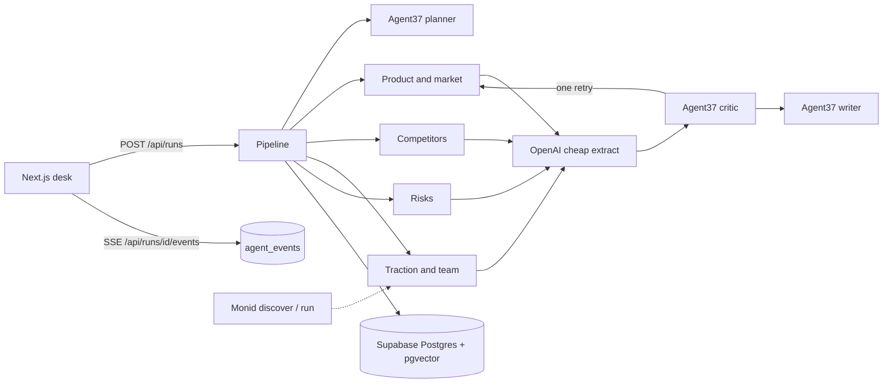

# Diligent

Diligent turns a startup name or URL into a one-page investment memo. Every sentence in the memo cites a finding. A critic drops any finding that has no real URL, no quote, or a quote that does not support the claim.

The seeded demo is **Resend** (YC W23). Open the app and press **Play trace** to watch the four research lanes, the critic rejecting an unsourced market-share claim, and the finished memo. That replay finishes in under a minute. **Run live** does the same work through Agent37 and usually takes a couple of minutes.

## Setup

```bash
npm install
cp .env.example .env.local
npm run dev
```

Open http://localhost:3000. With no keys, the page still loads the seeded Resend memo from a local file (`.data/store.json`). If that file cannot be written, the same seed stays in process memory so the page still opens. Live runs need the keys below.

In the Supabase SQL editor, run [`supabase/schema.sql`](supabase/schema.sql) before the first live run. The app inserts the Resend seed on the first request if that run is missing, so you do not have to load a separate seed file.

## Environment

| Variable | Required | Where it is used |
| --- | --- | --- |
| `AGENT37_API_KEY` | Live runs | Hosting API (`Authorization: Bearer`) and instance API (`X-Agent37-Key`) |
| `AGENT37_INSTANCE_ID` | No | Reuse one instance instead of creating `diligent` |
| `AGENT37_INSTANCE_IDS` | No | Comma-separated pool. Sub-agents spread across it |
| `OPENAI_API_KEY` | Live runs | Cheap extraction, embeddings, and the model behind the Agent37 instance |
| `OPENAI_STRONG_MODEL` | No | Planner, research, critic, writer. Default `gpt-5.4` |
| `OPENAI_EXTRACT_MODEL` | No | Finding, plan, and review extraction. Default `gpt-5.4-nano` |
| `OPENAI_EMBED_MODEL` | No | Must stay 1536-dimensional. Default `text-embedding-3-small` |
| `SUPABASE_URL` | Persist | Postgres + pgvector |
| `SUPABASE_ANON_KEY` | Persist | Accepted if the service role key is absent |
| `SUPABASE_SERVICE_ROLE_KEY` | Preferred | Server-side reads and writes. Never sent to the browser |
| `MONID_API_KEY` | No | Traction lane calls Monid discover, then inspect, then run |
| `INSTACLOUD_TOKEN` | No | Only if you call the InstaCloud API yourself |

Agent37 bills the instance from your workspace wallet. Creating one needs about a day of compute credited, and web search on the managed Brave tool needs instance budget. The app sets `budget.credit_micros` to `2000000` ($2) when it creates the `diligent` instance, and points Hermes at OpenAI:

- `AGENT37_LLM_PROXY_URL=https://api.openai.com` (Agent37 normalizes this to `/v1`)
- `AGENT37_MANAGED_TOKEN` is your `OPENAI_API_KEY`
- `AGENT37_STARTER_MODEL_ID` is `OPENAI_STRONG_MODEL`

If you pass `AGENT37_INSTANCE_ID` for an instance that was not created this way, Diligent still sends the strong model, then retries once on the instance default if that model is refused.

## Architecture



1. **Planner** (`POST https://{instanceId}.agent37.app/v1/responses`) returns a JSON plan with one task per research agent. It does not browse.
2. **Four sub-agents** run at once, each in its own Agent37 session, on the Hermes template. They are told to web-search and open a page, then return `{ claim, evidence_quote, source_url, confidence }`.
3. **Extraction** uses the cheap OpenAI model when the agent reply is not already clean JSON.
4. **Critic** is another Agent37 turn. It rejects a claim with no real `source_url`, no quote, or a quote that does not support the claim. A local check also rejects an empty URL or a quote shorter than 12 characters, and it cannot overrule a rejection. Rejected claims go back to the owning agent once, then drop.
5. **Writer** is an Agent37 turn over the accepted findings only. The memo sections are Overview, Market, Competition, Traction, Red Flags, and Verdict (`Pass`, `Watch`, or `Invest`).
6. **Memory**: before research, the company and market label are embedded and matched against accepted findings with `match_findings` (cosine, pgvector). Hits are passed in as prior context, not as citations.

The browser never holds a vendor key. `GET /api/runs/:id/events` is a server-sent event stream that polls `agent_events`, so the trace moves without Supabase Realtime.

## Sponsor tools

| Tool | Role |
| --- | --- |
| Agent37 | Every agent turn: planner, four researchers, retries, critic, writer. Hosting API `https://api.agent37.com/v1/instances`. Chat API `https://{instanceId}.agent37.app/v1/responses` with `X-Agent37-Key`. |
| OpenAI | Strong model on those turns via the Agent37 proxy env. Cheap model for extraction. `text-embedding-3-small` for memory. |
| Supabase | `companies`, `runs`, `agent_events`, `findings` (with `vector(1536)`), `memos`, and `match_findings`. |
| Monid | Optional. Traction research calls `POST https://api.monid.ai/v1/discover`, then inspect, then run when the cheapest hit is under $0.05 and the input schema has an obvious string field. A failure is logged and skipped. |
| InstaCloud | Optional deploy. The repo includes a standalone Next.js `Dockerfile`. Follow [InstaCloud's deploy docs](https://docs.instacloud.com/introduction). The documented agent prompt is: "Deploy this app on InstaCloud with a Postgres database wired in." |

## Demo script

1. Open the app. Resend is already in the history list, verdict **Watch**.
2. Press **Play trace**. Product, competitors, traction, and risks start together. The critic rejects "Resend already controls more than half of the developer email market" because the quote is only "Resend is the email API for developers." The retry is dropped. The memo opens with clickable `[n]` citations.
3. For a live pass, set the keys, enter another YC company, and press **Run live**. The same lanes stream from Agent37.

Pass means decline.

## Deploy

The UI has no login. Judges can open whatever host you give them.

```bash
npm run build
npm start
```

Docker:

```bash
docker build -t diligent .
docker run --env-file .env.local -p 3000:3000 diligent
```

Vercel: import the repo and set the env vars from `.env.example`. The run route sets `maxDuration = 300`. A full live diligence can still outlive a short serverless limit; a long-lived Node process (`npm start` or the Docker image) is the reliable host.

## Tests

```bash
npm test
```

That checks JSON extraction, the critic's source floor, and that every sentence in the seeded memo cites an accepted finding.

## Schema

`supabase/schema.sql` creates the five tables, the HNSW cosine index, and `match_findings`. Row level security is on. The demo policies allow anon read and write so either Supabase key works from the server. Do not reuse those policies in production. The service role key bypasses RLS and is the right key to set.
